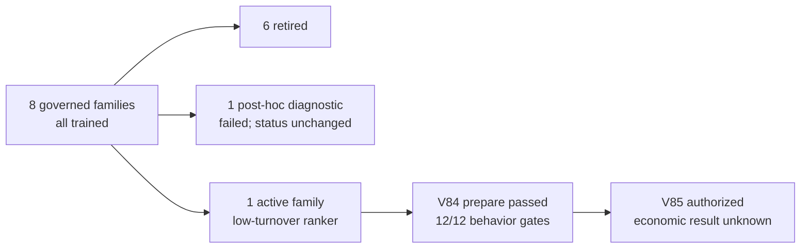
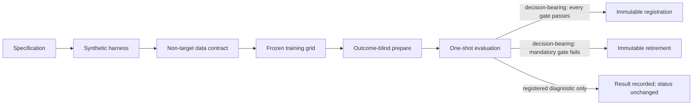

# TLM — Governed Multi-Asset Trading Research

TLM is a reproducible research system for testing whether compact temporal
models can turn causal, non-target crypto data into economically useful daily
decisions. The project treats failed hypotheses as first-class results: every
decision-bearing family is specified before data access, evaluated against
frozen gates, and either advanced or retired without rescue tuning. Registered
diagnostic-only evaluations may instead preserve the existing family status.

> [!IMPORTANT]
> TLM is research software, not a trading product. It does not place orders,
> use leverage, or authorize paper, shadow, live, or real-money trading. There
> is currently **no deployable strategy**. BTCUSDT, ETHUSDT, and SOLUSDT are the
> intended target assets and remain sealed under the active contract.

**Navigate:** [results dashboard](#model-family-scoreboard) ·
[active architecture](#active-architecture) ·
[reproducibility](#reproducibility-tiers) · [safe quickstart](#safe-quickstart)

## Research snapshot

The machine-readable source of truth is
[`research/current.yaml`](research/current.yaml). This README summarizes that
contract as of **2026-07-17**; if the two disagree, the contract wins.

| Families | Trained | Retired | Registered candidates | Deployable strategies |
|---:|---:|---:|---:|---:|
| **8** | **8** | **6** | **0** | **0** |



| Current research object | State |
|---|---|
| Active family | `tlm_low_turnover_cross_sectional_rank_v1` |
| Last completed phase | V84 outcome-blind low-turnover evaluation prepare |
| Exact next authorization | V85 one registered non-target outcome unseal and economic evaluation |
| Active execution objects | 9 completed jobs, 9 retained checkpoints, 1 prepared evaluation protocol, 0 registered candidates |
| Evidence boundary | Retrospective non-target first use in 2026; not prospective confirmation |
| Target assets | No evaluation; BTCUSDT, ETHUSDT, and SOLUSDT remain sealed |

For the validated live projection, see [`STATUS.md`](STATUS.md). The exact
phase boundary, permitted inputs, and forbidden operations live in
[`research/current.yaml`](research/current.yaml), its referenced experiment,
and its referenced phase contract.

## What makes TLM different

Most research repositories optimize for the best chart. TLM optimizes for an
auditable decision process:

- chronological roles and purged/embargoed boundaries instead of random
  time-series splits;
- train-only scalers and feature values available by the close of signal day
  `t`;
- execution no earlier than the registered next open;
- explicit entry, switch, exit, forced-exit, and final-liquidation turnover;
- frozen seeds, folds, controls, costs, policies, gates, and evidence roles;
- one-shot outcome access when a contract authorizes it;
- immutable retirement when a mandatory cell fails in a decision-bearing
  evaluation; status-neutral diagnostic evaluations are recorded separately;
- content-addressed packets and deterministic replay at each lifecycle gate.



### What counts as a model

TLM uses precise research nouns. A **family** is one frozen hypothesis,
architecture, objective, and policy. A **run** is one fold/seed/origin/geometry
cell. A **checkpoint** is one trained state. An **evaluation** is a frozen
protocol, and a **candidate** exists only after every preceding gate passes.
The table below therefore lists eight families—not every seed or checkpoint as
a separate model.

## Model-family scoreboard

All percentages below are historical non-target research results. Positive
diagnostics or aggregate returns do not override a failed fold, cost, drawdown,
turnover, or bootstrap gate. Gate totals are protocol-specific and should not be
compared as percentages across families.

| Status | Meaning |
|---|---|
| 🔴 **Retired** | A mandatory decision-bearing gate failed; the family is immutable. |
| 🟠 **Diagnostic failed** | A status-neutral diagnostic failed; lifecycle status did not change. |
| 🔵 **Active; economics unknown** | Training and outcome-blind preparation passed; no economic result has been opened. |

### Economic and diagnostic evidence

| Family / phases | Parameters | Net at 10 bps | Predictive / risk diagnostic | Selected gate result | Decision |
|---|---:|---:|---|---:|---|
| **Patch transfer**<br>V29–V37 | 380,276 | **-16.44%** | Sharpe -2.943; max drawdown -16.54% | 0/6 paired-bootstrap p05 | 🔴 **Retired** |
| **Rank / excess**<br>V41–V45 | 1,231,634 | **+15.34%** | Spearman 0.0546; pairwise 52.48%; fold 3 -10.55% | 36/39 | 🔴 **Retired** |
| **Joint triplet**<br>V47–V50 | 1,212,930 | — | Absolute-return correlation -0.0472 to 0.0225; sign accuracy 47.08%–50.44% | 67/180 | 🔴 **Retired** |
| **State quantile**<br>V55–V59 | 465,513 | Negative before costs in every aggregate cell | Risky exposure 0.3984% | 97/700 | 🔴 **Retired** |
| **Decoupled rank / state**<br>V60–V64 | 1,259,123 | **-15.07%** | Spearman 0.0652; pairwise 52.96%; net -20.78%/-30.21% at 20/30 bps | 19/36 | 🔴 **Retired** |
| **Probabilistic gate V64-R2**<br>V65–V73 | 1,259,156 | **-2.57%**<br>(+3.18% gross) | Sharpe -0.20; max drawdown -12.44%; turnover 57.33 | 13/24 diagnostic | 🟠 **Diagnostic failed** |

### Outcome-blind behavior evidence

| Family / phases | Parameters | Behavior result | Outcome access | Decision |
|---|---:|---|---|---|
| **Persistent duration**<br>V74–V79 | 1,083,155 | 11/12 gates; turnover **59.55 > 45.0 ceiling** | None | 🔴 **Retired before outcomes** |
| **Low-turnover ranker**<br>V80–current | **10,993** | 12/12 gates; turnover 1.527778; exposure 0.260863 | None; V85 authorized only | 🔵 **Active; economics unknown** |

> [!NOTE]
> A positive aggregate is not a passing result. The V45 family, for example,
> returned +15.34% net at 10 bps but was retired because a mandatory fold and
> two drawdown cells failed. A dash means a single comparable net figure is not
> reported here; explicit “no outcome” means outcome access was not authorized.
> Neither means a zero return.

### Model cards

<details>
<summary><strong>V29–V37 · tlm_multi_asset_target_transfer_v2</strong> — 🔴 Retired</summary>

- **Design:** 380,276-parameter shared causal Patch Transformer with
  masked-patch pretraining and q10/q50/q90 return and volatility heads.
- **Result:** at 10 bps, -16.44% net, Sharpe -2.943, and maximum drawdown
  -16.54%. The Sharpe gate failed at 10/20/30 bps and all six registered
  paired-bootstrap p05 gates failed.
- **Boundary:** BTC/ETH/SOL were never opened.

</details>

<details>
<summary><strong>V41–V45 · tlm_cross_sectional_rank_excess_medium_v1</strong> — 🔴 Retired</summary>

- **Design:** 1,231,634-parameter Transformer with pairwise ranking and
  normalized excess-return objectives.
- **Result:** 36/39 cells passed; Spearman was 0.0546, pairwise accuracy 52.48%,
  and aggregate net return +15.34% at 10 bps. Fold 3 returned -10.55%, while
  the 20/30-bps drawdown caps failed.
- **Decision:** the three failed mandatory cells retired the family.

</details>

<details>
<summary><strong>V47–V50 · tlm_joint_absolute_relative_triplet_medium_v1</strong> — 🔴 Retired</summary>

- **Design:** 1,212,930 parameters decomposing market return `m`, centered
  excess `e`, and absolute forecast `mu = m + e`.
- **Result:** 67/180 gates passed. Fold returns, turnover, control comparisons,
  and all 48 bootstrap cells failed; absolute-return correlation ranged from
  -0.0472 to 0.0225 and sign accuracy from 47.08% to 50.44%.

</details>

<details>
<summary><strong>V55–V59 · tlm_state_conditioned_multi_horizon_quantile_small_v1</strong> — 🔴 Retired</summary>

- **Design:** 465,513 parameters with 1/3/7-day q20/q50/q80 forecasts and a
  weekly h7-q20 state policy.
- **Result:** 97/700 gates passed, including every ordinal gate, but only 1/12
  fold-return gates and 0/540 bootstrap gates passed. Every aggregate cell was
  negative before costs and risky exposure was 0.3984%.

</details>

<details>
<summary><strong>V60–V64 · tlm_decoupled_rank_state_medium_v1</strong> — 🔴 Retired</summary>

- **Design:** frozen 1,231,634-parameter ranker plus an independent
  27,489-parameter absolute-state gate; 1,259,123 parameters total.
- **Result:** 19/36 gates passed. Spearman 0.0652 and pairwise accuracy 52.96%
  coexisted with net returns of -15.07%, -20.78%, and -30.21% at 10/20/30 bps.
- **Lesson:** relative prediction did not convert into economic value.

</details>

<details>
<summary><strong>V65–V73 · tlm_decoupled_rank_state_probabilistic_gate_v2 (V64-R2)</strong> — 🟠 Diagnostic failed</summary>

- **Design:** exact frozen V64 rankers plus a 27,522-parameter Student-t state
  gate and a fixed 60% cost-clearance threshold; 1,259,156 parameters total.
- **Result:** one immutable consumed-2025 diagnostic packet produced +3.18%
  gross but -2.57% net at 10 bps, Sharpe -0.20, maximum drawdown -12.44%,
  turnover 57.33, and 13/24 passing gates.
- **Boundary:** this was post-hoc diagnostic evidence, not prospective evidence;
  the family status did not change.

</details>

<details>
<summary><strong>V74–V79 · tlm_persistent_multi_horizon_duration_v1</strong> — 🔴 Retired before outcomes</summary>

- **Design:** fresh 1,083,155-parameter causal Transformer with Student-t
  1/3/7-day return heads and an explicit 1–7-day duration hazard.
- **Engineering evidence:** V74, V75, and V76 passed 16/16, 17/17, and 16/16
  checks; V77 retained nine fresh checkpoints after 6,976 optimizer steps.
- **Decision:** V78 passed 11/12 outcome-blind behavior gates but turnover was
  59.55 against the frozen 45.0 ceiling. V79 recorded retirement without
  opening outcomes, computing PnL, retuning, or accessing target assets.

</details>

<details open>
<summary><strong>V80–current · tlm_low_turnover_cross_sectional_rank_v1</strong> — 🔵 Active; economic result unknown</summary>

- **Design:** new 10,993-parameter causal depthwise-TCN/DeepSets ranker trained
  on centered 21-day excess returns with a structurally low-turnover
  long-one-or-cash policy.
- **Evidence:** V80 passed 14/14 specification checks, V81 passed 15/15
  synthetic checks, V82-R0 passed 14/14 chronology checks, V82 passed 20/20
  dataset checks, V83 passed all 12 terminal training checks with nine fresh
  checkpoints and 5,040 optimizer steps, and V84 passed all 12 outcome-blind
  behavior gates.
- **Current boundary:** V85 alone is authorized for exactly one registered
  5,370-row non-target outcome opening. It has not started; BTC/ETH/SOL remain
  sealed, and no candidate is registered.

</details>

Evidence for these decisions is preserved in
[`TASKS.md`](TASKS.md), [`STATUS.md`](STATUS.md), the
[`research/experiments`](research/experiments) contracts, and the archived
[`V1–V55 lineage`](docs/research/lineage-v1-v55.md). The V74 sequence-index
receipt contained a malformed 61-character hash. V76 registered the
authoritative 64-character V32 manifest value before any dataset
deserialization and then completed with 43,478 fully labelled persistent rows,
24,060 train-eligible rows, and 10,628 internal-validation rows. No scientific
value or contract semantics changed, and no 2025 label value was loaded.

### How to read the scoreboard

- **Synthetic pass is engineering evidence, not alpha.** It proves tensor
  geometry, causality, gradients, costs, checkpointing, and replay behavior.
- **Training completion is not an economic result.** Losses and predictive
  metrics remain diagnostics until the frozen policy and gates are evaluated.
- **Positive aggregates cannot rescue failed cells.** Asset folds, costs, and
  bootstrap gates are mandatory individually.
- **Gross is not net.** Costs are charged on every registered unit of turnover,
  including final liquidation.
- **Historical development is not prospective confirmation.** No governed
  V29+ family has clean target-domain or deployable evidence.

## Active architecture

The active family was created after the persistent-duration family exceeded its
preregistered turnover ceiling. It removes duration and absolute-state heads,
optimizes only centered cross-sectional rank, and limits trading frequency by
construction rather than by post-hoc threshold tuning.

```text
non-target features [batch, 128 days, 3 assets, 8 features]
        -> train-fold-only median/IQR scaling
        -> feature LayerNorm and shared 8 -> 32 projection
        -> six causal depthwise-TCN residual blocks
           (kernel 3; dilations 1, 2, 4, 8, 16, 32;
            127-day receptive field)
        -> concatenate asset encoding, triplet mean, and asset-minus-mean
        -> shared 96 -> 32 -> 1 rank head
        -> subtract the context mean to produce centered scores
        -> long one asset or cash on the frozen 21-day decision clock
```

Frozen properties:

- 10,993 parameters and one architecture variant;
- centered open-`t+1` to open-`t+22` 21-interval excess-return target;
- SmoothL1 point loss plus `0.50` all-pairs logistic ranking loss;
- no PnL loss, turnover loss, auxiliary absolute head, or state head;
- 3 asset-disjoint folds × seeds `42`, `7`, and `123`;
- all nine fresh MPS checkpoints retained without fold, seed, or epoch selection;
- trailing 63-calendar-day positive-market gate, `0.25` switch margin, and
  long-one-or-cash action space;
- at most eight evaluation decisions and structural turnover at most `16.0`,
  including final liquidation;
- 10 bps base cost with 10/20/30 bps reporting;
- BTCUSDT, ETHUSDT, and SOLUSDT excluded until a future contract explicitly
  opens them.

See the [V80 frozen design](configs/v80_low_turnover_rank_spec.yaml),
[V83 training contract](research/phase_contracts/v083.yaml),
[V84 prepare contract](research/phase_contracts/v084.yaml), and
[V85 one-shot contract](research/phase_contracts/v085.yaml) for the complete
design and current access boundary.

### Active-family progression

| Phase | Evidence established | State |
|---|---|---|
| V80 · Specification | One 10,993-parameter architecture and structural turnover ceiling frozen | **Passed · 14/14** |
| V81 · Synthetic harness | Causality, permutation behavior, resume, CPU/MPS, and replay | **Passed · 15/15** |
| V82-R0 · Chronology | Final signal date and inclusive count corrected without semantic changes | **Passed · 14/14** |
| V82 · Dataset | 2,393 archives verified; one corrupt official month preserved as an explicit gap | **Passed · 20/20** |
| V83 · Training | Nine fresh checkpoints retained; 5,040 optimizer steps; no fold/seed selection | **Passed · 12/12** |
| V84 · Outcome-blind prepare | Predictions and positions frozen; turnover 1.527778; no outcomes or PnL opened | **Passed · 12/12** |
| V85 · Economic evaluation | Exactly one registered non-target outcome opening | **Authorized · not started** |

V84 froze 440,784 predictions, 193,320 candidate-position rows, and 579,960
control-position rows before outcome access. These are behavior and provenance
quantities, not evidence of profitability. No candidate is registered.

**Known:** the model is causal, reproducible, fully trained, and meets its
frozen behavior constraints.

**Unknown:** profitability, risk-adjusted performance, bootstrap robustness,
target-domain transfer, and deployability.

## Earlier prototypes and signal studies

V1–V25 predate the current eight-family registry. They are retained as
scientific ancestry, not counted as eight additional models.

| Line | Outcome |
|---|---|
| V1–V6: baselines and three-seed Transformer consensus | The original consensus result did not survive the denser V6 expanding/rolling validation. Dual momentum remained a comparator, not a deployable strategy. |
| V7: Gradient Boosting `OverrideNet` | Rejected after nested walk-forward validation reduced return and Sharpe and worsened drawdown versus its control. |
| V8: q10/q50 risk-off meta-labeler | Rejected: calibration did not identify a stable loss subset while preserving enough control return. |
| V9, V11, V12, V15, V19: OHLCV, derivatives, intraday path, DVOL, and Treasury signal studies | No registered signal passed the complete stability, coverage, and bootstrap contract. |
| V16: CFTC positioning feasibility | Rejected for historical causal joins because a complete publication calendar could not be established. |
| V20–V25: evidence ledger and final audit | Closed the line with no learned candidate, no robust signal, and no clean-holdout decision. |

Controls such as always-long, equal weight, Ridge, and 30-day dual momentum are
research comparators. They are not promoted model families or trading advice.

## Safe quickstart

Requirements: Python 3.11 or newer. Portable code tests run on CPU; exact
registered training grids require Apple Silicon with MPS and the frozen local
artifact store.

```bash
python3 -m venv .venv
source .venv/bin/activate
python3 -m pip install --upgrade pip
python3 -m pip install -e '.[dev]'
```

Inspect the CLI and run the fresh-clone-safe test slice:

```bash
python3 -m tlm --help
python3 -m pytest -q \
  tests/test_model.py \
  tests/test_backtest.py \
  tests/test_leakage.py \
  tests/test_low_turnover_rank_harness.py
```

The deterministic MVP smoke is an offline engineering fixture, not current
family performance evidence:

```bash
PYTHONPATH=src python3 -m tlm smoke --config configs/mvp.yaml
```

Do not run historical `make run-v*`, training, prepare, unseal, or evaluation
commands merely because they remain in the source tree. The only executable
research capability is the exact `authorized_next_action` in
[`research/current.yaml`](research/current.yaml).

### Reproducibility tiers

| Tier | Public clone | Canonical research workspace |
|---|---:|---:|
| Source, configs, tests, and frozen contracts | Yes | Yes |
| CPU unit tests and deterministic MVP smoke | Yes | Yes |
| Historical receipt and report inspection | Selected metadata only | Yes |
| Full `research-status` / research doctor | No; requires hash-bound local inputs | Yes |
| Raw/processed market data and checkpoints | No | Local, ignored, content-addressed |
| Registered MPS training/evaluation replay | No | Only when the current contract authorizes it |

A public clone is therefore **source-transparent, not a complete artifact or
data distribution**. The full test suite includes packet-verification tests
that intentionally require locally retained immutable artifacts. Do not infer
failed research or source drift merely from those files being absent in a
public clone.

## Data and artifact policy

- Raw and processed market data, Parquets, checkpoints, predictions, positions,
  outcome packets, and large generated panels stay outside ordinary Git.
- Missing observations remain explicit; source gaps are never silently filled.
- Public-data access does not imply redistribution rights. In particular, no
  redistribution claim is made for cached Deribit responses.
- Published evidence should consist of reviewed contracts, reports, manifests,
  and content-addressed receipts—not executable checkpoints or outcome tables.
- Never commit `.env` files, API keys, credentials, wallet material, or private
  certificates. This project does not require them for the safe quickstart.

The canonical research history is not the public distribution. Build the
scanned archive and separate one-commit public repository with
`make public-release`, then follow the exact
[public release procedure](docs/PUBLIC_RELEASE.md) before pushing to GitHub.

## Repository map

| Path | Purpose |
|---|---|
| [`src/tlm`](src/tlm) | Models, datasets, accounting, training, evaluation, and audit code |
| [`tests`](tests) | Causality, leakage, accounting, resume, replay, and phase-boundary tests |
| [`configs`](configs) | Frozen phase and runner configuration |
| [`research/current.yaml`](research/current.yaml) | Binding current state and sole next authorization |
| [`research/experiments`](research/experiments) | Immutable experiment records |
| [`research/phase_contracts`](research/phase_contracts) | Exact capability and access boundaries |
| [`STATUS.md`](STATUS.md) | Human-readable current-state projection |
| [`TASKS.md`](TASKS.md) | Executable definitions of done, gates, and historical decisions |
| [`docs/research/lineage-v1-v55.md`](docs/research/lineage-v1-v55.md) | Archived early research lineage |

## Contributing

Before any research change:

1. Read [`AGENTS.md`](AGENTS.md) and `research/current.yaml`.
2. Validate the binding contract; never infer permission from this README,
   historical code, or a promising metric.
3. Keep target assets, forbidden columns, and held-out outcomes outside tensors
   unless an explicit receipt opens them.
4. Add focused tests and run the safe suite appropriate to the available
   artifact tier.
5. Do not include generated data, checkpoints, predictions, positions, or
   outcomes in a pull request.

Retired families are immutable. A new hypothesis requires a new family and a
new preregistered lifecycle.

## License, citation, and disclaimer

This repository does not yet include an open-source license. Source visibility
does not grant permission to copy, modify, or redistribute it; a license must
be chosen before an open-source release.

Formal citation metadata is provided in [`CITATION.cff`](CITATION.cff). Cite
the exact public commit and the relevant immutable experiment contract so the
research state and evidence boundary remain unambiguous.

Nothing in this repository is financial advice. Historical results are
research diagnostics, may reflect consumed development windows, and do not
represent expected future performance.
